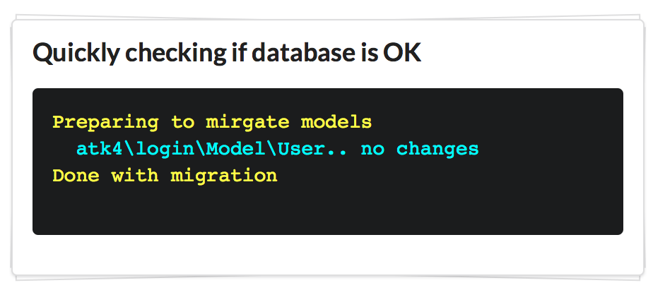

# Agile Data - SQL Schema Management Add-on

This extension for Agile Data implements ability to work with SQL schema, execute migrations, perform DB-tests in PHPUnit (used by other ATK frameworks) and sync up "Model" structure to the database.

### Basic Usage:

``` php
// Add the following code on your setup page / wizard:

$app->add('MigratorConsole')
    ->migrateModels([
        new Model\User($app->db), 
        new Model\Order($app->db),
        new Model\Payment($app->db)
    ]);
```

The user will see a console which would adjust database to contain required tables / fields for the models:



Of course it's also possible to perform migration without visual feedback:

``` php
$changes = (new \atk4\schema\Migration\MySQL(new User($app->db)))->migrate();
```

If you need a more fine-graned migration, you can define them in great detail.

``` php
// create table
$migration = new \atk4\schema\Migration\MySQL($app->db);
$migration->table('user')
    ->id()
    ->field('name')
    ->field('address', ['type'=>'text']);
    ->create();

// or alter
$migration = new \atk4\schema\Migration\MySQL($app->db);
$migration->table('user')
    ->newField('age', ['type'=>'integer'])
    ->alter();
```

You can also use `\atk4\schema\Migration\Sqlite`. Other SQL databases are not yet supported. Field declaration uses same types as [ATK Data](https://github.com/atk4/data).

## Examples

`schema\Migration` is a simple class for building schema-related
queries using DSQL.

``` php
<?php
$m = new \atk4\data\schema\Migration($connection);
$m->table('user')->drop();
$m->field('id');
$m->field('name', ['type'=>'string']);
$m->field('age', ['type'=>'integer']);
$m->field('bio');
$m->create();
```

`schema\Snapshot` is a simple class that can record and restore
table contents:

``` php
<?php
$s = new \atk4\data\schema\Snapshot($connection);
$tables = $s->getDB($tables);

// do anything with tables

$s->setDB($tables);
```

## Integration with PHPUnit

You can now automate your database testing by setting and checking your
database contents easier. First, extend your test-script from
`\atk4\schema\PHPUnit_SchemaTestCase`. 

Next, you need to set your schema

``` php
$q = ['user' => [
    ['name' => 'John', 'surname' => 'Smith'],
    ['name' => 'Steve', 'surname' => 'Jobs'],
]];
$this->setDB($q);
```

Perform any changes, then execute:

```
$this->assertEquals($q, $this->getDB('user'));
```

To ensure that database remained the same. Of course you can compare
against any other state. 

- Automatically add 'id' field by default
- Create tables for you
- Detect types (int, string, etc)
- Hides ID values if you don't pass them

## Installation

Add the following inside your `composer.json` file:

``` console
composer require atk4/schema
```

## Current Status

Stable functionality

